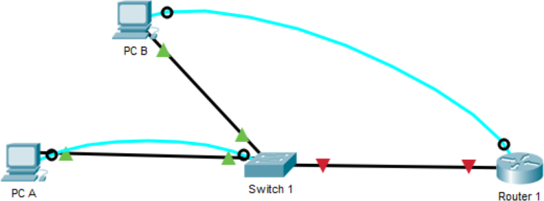

## Labo n°1 : Configuration de base

```diff
-> Morgan Valentin
```

#### Schéma du labo : 



---

#### Astuces connexion COM sur linux

```bash
sudo dmesg | grep -i tty # Permet de trouver le port
sudo screen /dev/ttyUSB0 # Permet de se connecter au port
# "ttyUSB0" => C'est mon port, le votre sera peut-être différent
```

---

| R1   |
| ---- |

`hostname R1`\
`enable secret cisco`\
`no ip domain-lookup`\
`ip domain-name henallux.be`

`username admin password class`\
`crypto key generate rsa general-keys modulus 1024`\
`ip ssh version 2`

> **int f0/1**\
> `description Vers S1`\
> `ip add 192.168.10.90 255.255.255.0`\
> `no shut`

> **line vty 0 4**\
> `transport input ssh`\
> `login local`

> **line console 0**\
> `logging synchronous`

---

| S1|
| ------- |

`hostname S1`\
`no ip domain-lookup`

> **int vlan1**\
> `ip add 192.168.10.80 255.255.255.0`

`ip default-gateway 192.168.10.90`

---

|PCA |
|---|

 ipv4 address        | 192.168.10.10 
 ------------------- | ------------- 
 **Subnet Mask**     | 255.255.255.0 
 **Default Gateway** | 192.168.10.90 

---

|PCB |
|---|

 ipv4 address        | 192.168.10.20 
 ------------------- | ------------- 
 **Subnet Mask**     | 255.255.255.0 
 **Default Gateway** | 192.168.10.90 
