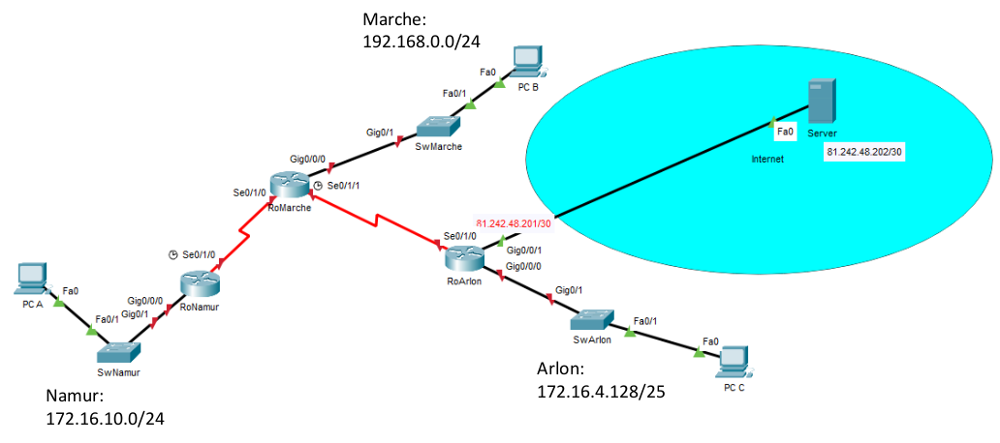

## Labo n°2 : Routage Statique

```diff
-> Morgan Valentin
```

#### Schéma du labo : 



---

#### Répartitions des adresses IP

| Host/Device | Interface | IP          | Mask                  |
| ----------- | --------- | ----------- | --------------------- |
| RoNamur     | g0/0/0    | 172.16.10.1 | 255.255.255.0 (/24)   |
| RoNamur     | s0/1/0    | 10.10.10.1  | 255.255.255.252 (/30) |

| Host/Device | Interface | IP          | Mask                  |
| ----------- | --------- | ----------- | --------------------- |
| RoMarche    | g0/0/0    | 192.168.0.1 | 255.255.255.0 (/24)   |
| RoMarche    | s0/0/1    | 10.10.10.2  | 255.255.255.252 (/30) |
| RoMarche    | s0/1/1    | 10.10.10.5  | 255.255.255.252 (/30) |

| Host/Device | Interface | IP            | Mask                  |
| ----------- | --------- | ------------- | --------------------- |
| RoArlon     | g0/0/0    | 172.16.4.129  | 255.255.255.128 (/25) |
| RoArlon     | g0/0/1    | 81.242.48.201 | 255.255.255.252 (/30) |
| RoArlon     | s0/1/0    | 10.10.10.6    | 255.255.255.252 (/30) |


---

| RoNamur |
| ------- |

`hostname RoNamur`\
`no ip domain-lookup`

> **int g0/0/0**\
> `description vers namur`\
> `ip add 172.16.10.1 255.255.255.0`\
> `no shut`

> **int s0/1/0**\
> `description vers RoMarche`\
> `ip add 10.10.10.1 255.255.255.252`\
> `no shut`

! Route par défaut - Direct connecté \
`ip route 0.0.0.0 0.0.0.0 s0/1/0`

---

| RoMarche |
| ------- |

`hostname RoMarche`\
`no ip domain-lookup`\

> **int g0/0/0**\
> `description vers marche`\
> `ip add 192.168.0.1 255.255.255.0`\
> `no shut`

> **int s0/1/0**\
> `description vers RoNamur`\
> `ip add 10.10.10.2 255.255.255.252`\
> `no shut`

> **int s0/1/1**\
> `description vers RoArlon`\
> `ip add 10.10.10.5 255.255.255.252`\
> `no shut`

! Vers Namur -Récursive \
`ip route 172.16.10.0 255.255.255.0 10.10.10.1`

! Vers Arlon -Récursive par défaut \
`ip route 0.0.0.0 0.0.0.0 10.10.10.6`

---

| RoArlon|
| ------- |

`hostname RoArlon`\
`no ip domain-lookup`

> **int g0/0/0**\
> `description vers arlon`\
> `ip add 172.16.4.129 255.255.255.128`\
> `no shut`

> **int g0/0/1**\
> `description vers internet`\
> `ip add 81.242.48.201 255.255.255.252`\
> `no shut`

> **int s0/1/0**\
> `description vers RoMarche`\
> `ip add 10.10.10.6 255.255.255.252`\
> `no shut`

! Vers Internet -Direct Connecté \
`ip route 81.242.48.202 255.255.255.252 g0/0/1`

! Vers Namur -Direct Connecté \
`ip route 172.16.10.0 255.255.255.0 s0/1/0`

! Vers Marche -Récursive \
`ip route 192.168.0.0 255.255.255.0 10.10.10.5`

---

|PCA |
|---|

 ipv4 address        | 172.16.10.10   
 ------------------- | -------------- 
 **Subnet Mask**     | 255.255.255.0  
 **Default Gateway** | 172.16.10.1    

---

|PCB |
|---|

 ipv4 address        | 192.168.0.20   
 ------------------- | -------------- 
 **Subnet Mask**     | 255.255.255.0  
 **Default Gateway** | 192.168.0.1    

---

|PCC|
|---|

 ipv4 address        | 172.16.4.140    
 ------------------- | --------------- 
 **Subnet Mask**     | 255.255.255.128 
 **Default Gateway** | 172.16.4.129    