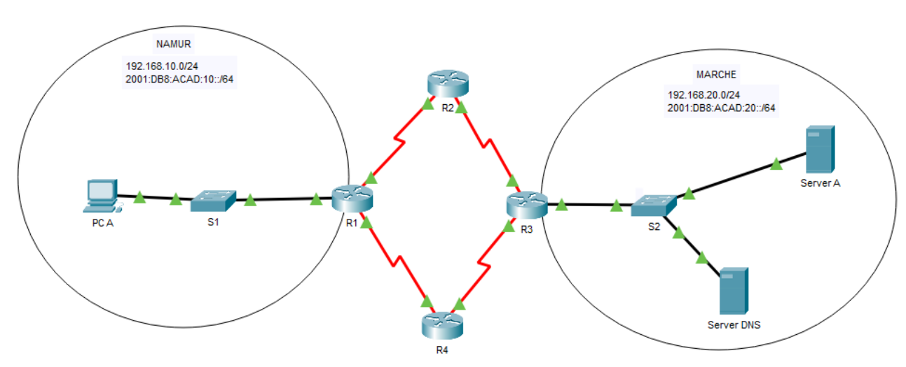

## Labo n°3 : Dual Stack

```diff
-> Morgan Valentin
```

#### Schéma du labo : 



---

#### Répartitions des adresses IP

| Host/Device | Interface | IP               | IPv6                              |
| ----------- | --------- | ---------------- | --------------------------------- |
| R1          | g0/0      | 192.168.10.1 /24 | `2001:DB8:ACAD:10::/64` => EUI-64 |
| R1 (=> R2)  | s0/0/0    | 10.10.10.1 /30   | `2001:DB8:ACAD:100::1/64`         |
| R1 (=> R4)  | s0/0/1    | 10.10.10.9 /30   | `2001:DB8:ACAD:102::1/64`         |

| Host/Device | Interface | IP             | IPv6                      |
| ----------- | --------- | -------------- | ------------------------- |
| R2 (=> R1)  | s0/0/0    | 10.10.10.2 /30 | `2001:DB8:ACAD:100::2/64` |
| R2 (=> R3)  | s0/0/1    | 10.10.10.5 /30 | `2001:DB8:ACAD:101::1/64` |

| Host/Device | Interface | IP               | IPv6                      |
| ----------- | --------- | ---------------- | ------------------------- |
| R3          | g0/0      | 192.168.20.1 /24 | `2001:DB8:ACAD:20::1/64`  |
| R3 (=> R4)  | s0/0/0    | 10.10.10.14 /30  | `2001:DB8:ACAD:103::2/64` |
| R3 (=> R2)  | s0/0/1    | 10.10.10.6 /30   | `2001:DB8:ACAD:101::2/64` |

| Host/Device | Interface | IP              | IPv6                      |
| ----------- | --------- | --------------- | ------------------------- |
| R4 (=> R3)  | s0/0/0    | 10.10.10.13 /30 | `2001:DB8:ACAD:103::1/64` |
| R4 (=> R1)  | s0/0/1    | 10.10.10.10 /30 | `2001:DB8:ACAD:102::2/64` |


---

|R1 |
|---|

`hostname R1`\
`no ip domain-lookup`\
`ipv6 unicast-routing`

> **int g0/0**\
`description vers Namur`\
`ip add 192.168.10.1 255.255.255.0`\
`ipv6 address 2001:DB8:ACAD:10::/64 eui-64`\
`ipv6 address FE80::1 link-local`\
`no shut`

>  **int s0/0/0**\
> `description vers R2`\
>  `ip add 10.10.10.1 255.255.255.252`\
>  `ipv6 add 2001:DB8:ACAD:100::1/64`\
>  `ipv6 address FE80::1 link-local`\
>  `no shut`

> **int s0/0/1**\
`description vers R4`\
`ip add 10.10.10.9 255.255.255.252`\
`ipv6 add 2001:DB8:ACAD:102::1/64`\
`ipv6 address FE80::1 link-local`\
`no shut`

`ip dhcp excluded-address 192.168.10.1`\

> **ip dhcp pool pool-ipv4**\
   `network 192.168.10.0 255.255.255.0`\
   `default-router 192.168.10.1`\
   `dns-server 192.168.20.250`

! Pour accéder au réseau de Marche \
`ip route 192.168.20.0 255.255.255.0 s0/0/0`\
`ip route 192.168.20.0 255.255.255.0 s0/0/1`\
`ipv6 route 2001:DB8:ACAD:20::/64 s0/0/0`\
`ipv6 route 2001:DB8:ACAD:20::/64 s0/0/1`

---

|R2 |
|---|

`hostname R2`\
`no ip domain-lookup`\
`ipv6 unicast-routing`

> **int s0/0/0**\
`description vers R1`\
`ip add 10.10.10.2 255.255.255.252`\
`ipv6 add 2001:DB8:ACAD:100::2/64`\
`ipv6 address FE80::2 link-local`\
`no shut`

>  **int s0/0/1**\
> `description vers R3`\
>  `ip add 10.10.10.5 255.255.255.252`\
>  `ipv6 add 2001:DB8:ACAD:101::1/64`\
>  `ipv6 address FE80::2 link-local`\
>  `no shut`

! Pour accéder au réseau de Marche - Passer par R3 \
`ip route 192.168.20.0 255.255.255.0 s0/0/1`\
`ipv6 route 2001:DB8:ACAD:20::/64 s0/0/1`

! Pour accéder au réseau de Namur - Passer par R1 \
`ip route 192.168.10.0 255.255.255.0 s0/0/0`\
`ipv6 route 2001:DB8:ACAD:10::/64 s0/0/0`

---

|R3 |
|---|

`hostname R3`\
`no ip domain-lookup`\
`ipv6 unicast-routing`

> **int g0/0**\
`description vers Marche`\
`ip add 192.168.20.1 255.255.255.0`\
`ipv6 address 2001:DB8:ACAD:20::1/64`\
`ipv6 address FE80::3 link-local`\
`no shut`

>  **int s0/0/0**\
> `description vers R4`\
>  `ip add 10.10.10.14 255.255.255.252`\
>  `ipv6 add 2001:DB8:ACAD:103::2/64`\
>  `ipv6 address FE80::3 link-local`\
>  `no shut`

> **int s0/0/1**\
`description vers R2`\
`ip add 10.10.10.6 255.255.255.252`\
`ipv6 add 2001:DB8:ACAD:101::2/64`\
`ipv6 address FE80::3 link-local`\
`no shut`

! Pour accéder au réseau de Namur \
`ip route 192.168.10.0 255.255.255.0 s0/0/0`\
`ip route 192.168.10.0 255.255.255.0 s0/0/1`\
`ipv6 route 2001:DB8:ACAD:10::/64 s0/0/0`\
`ipv6 route 2001:DB8:ACAD:10::/64 s0/0/1`

---

|R4 |
|---|

`hostname R4`\
`no ip domain-lookup`\
`ipv6 unicast-routing`

> **int s0/0/0**\
`description vers R3`\
`ip add 10.10.10.13 255.255.255.252`\
`ipv6 add 2001:DB8:ACAD:103::1/64`\
`ipv6 address FE80::4 link-local`\
`no shut`

>  **int s0/0/1**\
> `description vers R1`\
>  `ip add 10.10.10.10 255.255.255.252`\
>  `ipv6 add 2001:DB8:ACAD:102::2/64`\
>  `ipv6 address FE80::4 link-local`\
>  `no shut`

! Pour accéder au réseau de Marche - Passer par R3 \
`ip route 192.168.20.0 255.255.255.0 s0/0/0`\
`ipv6 route 2001:DB8:ACAD:20::/64 s0/0/0`

! Pour accéder au réseau de Namur - Passer par R1 \
`ip route 192.168.10.0 255.255.255.0 s0/0/1`\
`ipv6 route 2001:DB8:ACAD:10::/64 s0/0/1`

---

PCA => DHCP IPv4 et SLAAC IPv6

|Server A |
|---|

 ipv4 address        | 192.168.20.10  
 ------------------- | -------------- 
 **Subnet Mask**     | 255.255.255.0  
 **Default Gateway** | 192.168.20.1   
 **DNS Server**      | 192.168.20.250 

 ipv6 address           | 2001:DB8:ACAD:20::10/64 
 ---------------------- | ----------------------- 
 **link local address** | FE80::10                
 **ipv6 gateway**       | 2001:DB8:ACAD:20::1     
 **ipv6 DNS Server**    | 2001:DB8:ACAD:20::250   

---

|Server DNS |
|---|

 ipv4 address        | 192.168.20.250 
 ------------------- | -------------- 
 **Subnet Mask**     | 255.255.255.0  
 **Default Gateway** | 192.168.20.1   
 **DNS Server**      | 192.168.20.250 

 ipv6 address           | 2001:DB8:ACAD:20::250/64 
 ---------------------- | ------------------------ 
 **link local address** | FE80::250                
 **ipv6 gateway**       | 2001:DB8:ACAD:20::1      
 **ipv6 DNS Server**    | 2001:DB8:ACAD:20::250    

**(DNS)**

 Domain name | Record Type | Value                 
 ----------- | ----------- | --------------------- 
 server_a    | A           | 192.168.20.250        
 server_a_v6 | AAAA        | 2001:DB8:ACAD:20::250 