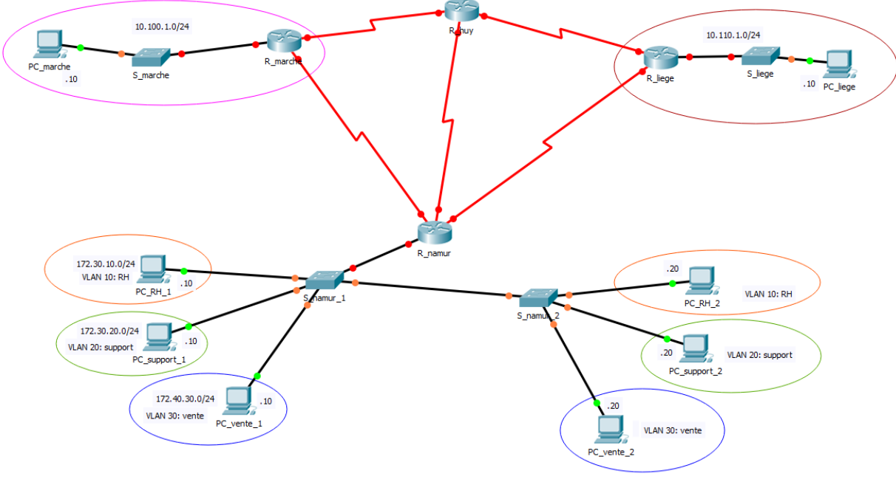

## Labo n°5 : VLAN et routage inter-VLAN

```diff
-> Morgan Valentin
```

#### Schéma du labo : 



---

#### Table d'adressage

| Host          | Network           | IP range                               | Broadcast     |
| ------------- | ----------------- | -------------------------------------- | ------------- |
| **LAN3 (60)** | 172.16.30.**0**   | 172.16.30.**1** => 172.16.30.**62**    | 172.16.30.63  |
| **LAN1 (20)** | 172.16.30.**64**  | 172.16.30.**65** => 172.16.30.**94**   | 172.16.30.95  |
| **LAN2 (7)**  | 172.16.30.**96**  | 172.16.30.**97** => 172.16.30.**110**  | 172.16.30.111 |
| **WAN12**     | 172.16.30.**112** | 172.16.30.**113** => 172.16.30.**114** | 172.16.30.115 |
| **WAN13**     | 172.16.30.**116** | 172.16.30.**117** => 172.16.30.**118** | 172.16.30.119 |
| **WAN23**     | 172.16.30.**120** | 172.16.30.**121** => 172.16.30.**122** | 172.16.30.123 |

---

#### Répartitions des adresses IP

| Host/Device | Interface | IP           | Mask                  |
| ----------- | --------- | ------------ | --------------------- |
| R_marche    | g0/0      | 10.100.1.1   | 255.255.255.0 (/24)   |
| R_marche    | s0/0/0    | 192.168.10.9 | 255.255.255.252 (/30) |
| R_marche    | s0/0/1    | 192.168.10.1 | 255.255.255.252 (/30) |

| Host/Device | Interface | IP            | Mask                  |
| ----------- | --------- | ------------- | --------------------- |
| R_huy       | s0/0/0    | 192.168.10.5  | 255.255.255.252 (/30) |
| R_huy       | s0/0/1    | 192.168.10.13 | 255.255.255.252 (/30) |
| R_huy       | s0/1/0    | 192.168.10.2  | 255.255.255.252 (/30) |

| Host/Device | Interface | IP            | Mask                  |
| ----------- | --------- | ------------- | --------------------- |
| R_liege     | g0/0      | 10.110.1.1    | 255.255.255.0 (/24)   |
| R_liege     | s0/0/0    | 192.168.10.6  | 255.255.255.252 (/30) |
| R_liege     | s0/0/1    | 192.168.10.17 | 255.255.255.252 (/30) |

| Host/Device | Interface | IP            | Mask                  |
| ----------- | --------- | ------------- | --------------------- |
| R_namur     | s0/0/0    | 192.168.10.10 | 255.255.255.252 (/30) |
| R_namur     | s0/0/1    | 192.168.10.14 | 255.255.255.252 (/30) |
| R_namur     | s0/1/0    | 192.168.10.18 | 255.255.255.252 (/30) |
| R_namur     | g0/0.10   | 172.30.10.1   | 255.255.255.0 (/24)   |
| R_namur     | g0/0.20   | 172.30.20.1   | 255.255.255.0 (/24)   |
| R_namur     | g0/0.30   | 172.40.30.1   | 255.255.255.0 (/24)   |

---

| R_marche |
| -------- |

`hostname R_marche`

> **int g0/0**\
> `ip address 10.100.1.1 255.255.255.0`\
> `no shut`

> **int s0/0/0**\
> `ip address 192.168.10.9 255.255.255.252`\
> `no shut`

> **int s0/0/1**\
> `ip address 192.168.10.1 255.255.255.252`\
> `no shut`

> **router rip**\
> `version 2`\
> `passive-interface g0/0`\
> `network 10.0.0.0`\
> `network 192.168.10.0`\
> `no auto-summary`

---

|R_huy |
|---|

`hostname R_huy`

> **int s0/0/0**\
> `ip address 192.168.10.5 255.255.255.252`\
> `no shut`

> **int s0/0/1**\
> `ip address 192.168.10.13 255.255.255.252`\
> `no shut`

> **int s0/1/0**\
> `ip address 192.168.10.2 255.255.255.252`\
> `no shut`

> **router rip**\
> `version 2`\
> `network 192.168.10.0`\
> `no auto-summary`

---

|R_liege |
|---|

`hostname R_liege`

> **int g0/0**\
> `ip address 10.110.1.1 255.255.255.0`\
> `no shut`

> **int s0/0/0**\
> `ip address 192.168.10.6 255.255.255.252`\
> `no shut`

> **int s0/0/1**\
> `ip address 192.168.10.17 255.255.255.252`\
> `no shut`

> **router rip**\
> `version 2`\
> `passive-interface g0/0`\
> `network 10.0.0.0`\
> `network 192.168.10.0`\
> `no auto-summary`

---

|R_namur |
|---|

`hostname R_namur`

> **int g0/0**\
> `no shut`

> **int g0/0.10**\
> `encapsulation dot1Q 10`\
> `ip address 172.30.10.1 255.255.255.0`

> **int g0/0.20**\
> `encapsulation dot1Q 20`\
> `ip address 172.30.20.1 255.255.255.0`

> **int g0/0.30**\
> `encapsulation dot1Q 30`\
> `ip address 172.40.30.1 255.255.255.0`

> **int s0/0/0**\
> `ip address 192.168.10.10 255.255.255.252`\
> `no shut`

> **int s0/0/1**\
> `ip address 192.168.10.14 255.255.255.252`\
> `no shut`

> **int s0/1/0**\
> `ip address 192.168.10.18 255.255.255.252`\
> `no shut`

> **router rip**\
> `version 2`\
> `passive-interface g0/0.10`\
> `passive-interface g0/0.20`\
> `network 172.30.0.0`\
> `network 192.168.10.0`\
> `no auto-summary`

---

|S_namur_1 |
|---|

`hostname S_namur_1`\
`ip domain-name henallux.be`\
`username ssh secret ssh`\

> **int f0/1**\
> `switchport access vlan 10`\
> `switchport mode access`

> **int f0/9**\
> `switchport access vlan 20`\
> `switchport mode access`

> **int f0/17**\
> `switchport access vlan 30`\
> `switchport mode access`

> **int g0/1**\
> `switchport mode trunk`

> **int g0/2**\
> `switchport mode trunk`

> **int Vlan20**\
> `ip address 172.30.20.30 255.255.255.0`

`ip default-gateway 172.30.20.1`

> **line vty 0 4**\
> `login local`\
> `transport input ssh`

---

|S_namur_2 |
|---|

`hostname S_namur_2`\
`ip domain-name henallux.be`\
`username ssh secret ssh`

> **int f0/1**\
> `switchport access vlan 10`\
> `switchport mode access`

> **int f0/9**\
> `switchport access vlan 20`\
> `switchport mode access`

> **int f0/17**\
> `switchport access vlan 30`\
> `switchport mode access`

> **int g0/2**\
> `switchport mode trunk`

> **int Vlan20**\
> `ip address 172.30.20.40 255.255.255.0`

`ip default-gateway 172.30.20.1`

> **line vty 0 4**\
> `login local`\
> `transport input ssh`

---

|PC_RH_1 |
|---|

 ipv4 address        | 172.30.10.10 
 ------------------- | -------------- 
 **Subnet Mask**     | 255.255.255.0 
 **Default Gateway** | 172.30.10.1 

|PC_RH_2|
|---|

 ipv4 address        | 172.30.10.20 
 ------------------- | -------------- 
 **Subnet Mask**     | 255.255.255.0 
 **Default Gateway** | 172.30.10.1 

|PC_support_1 |
|---|

 ipv4 address        | 172.30.20.10 
 ------------------- | -------------- 
 **Subnet Mask**     | 255.255.255.0 
 **Default Gateway** | 172.30.20.1 

|PC_support_2 |
|---|

 ipv4 address        | 172.30.20.20 
 ------------------- | -------------- 
 **Subnet Mask**     | 255.255.255.0 
 **Default Gateway** | 172.30.20.1 

|PC_vente_1 |
|---|

 ipv4 address        | 172.40.30.10 
 ------------------- | -------------- 
 **Subnet Mask**     | 255.255.255.0 
 **Default Gateway** | 172.40.30.1 

|PC_vente_2 |
|---|

 ipv4 address        | 172.40.30.20 
 ------------------- | -------------- 
 **Subnet Mask**     | 255.255.255.0 
 **Default Gateway** | 172.40.30.1 