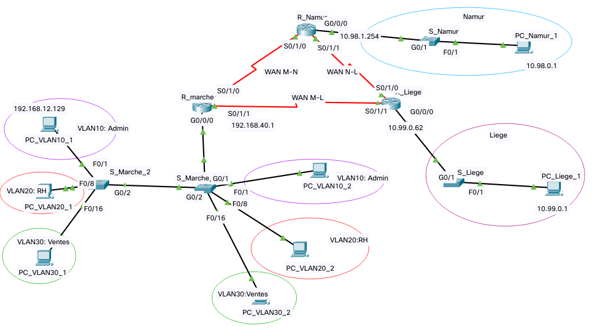

## Labo n°6 : Examen Blanc

```diff
-> Morgan Valentin
```

#### Schéma du labo : 



---


#### Table d'adressage

| NAMUR |
| -------- |

| Host    | Network   | IP range                 | Broadcast   |
| ------- | --------- | ------------------------ | ----------- |
| **400** | 10.98.0.0 | 10.98.0.1 => 10.98.1.254 | 10.98.1.255 |

| LIEGE |
| ----- |

| Host   | Network   | IP range                | Broadcast  |
| ------ | --------- | ----------------------- | ---------- |
| **60** | 10.99.0.0 | 10.99.0.1 => 10.99.0.62 | 10.99.0.63 |

| MARCHE |
| ------ |

| Host              | Network            | IP range                                 | Broadcast      |
| ----------------- | ------------------ | ---------------------------------------- | -------------- |
| **120** (VLAN 20) | 192.168.12.0       | 192.168.12.**1** => 192.168.12.**126**   | 192.168.12.127 |
| **28** (VLAN10)   | 192.168.12.**128** | 192.168.12.**129** => 192.168.12.**158** | 192.168.12.159 |

| Host             | Network      | IP range                              | Broadcast     |
| ---------------- | ------------ | ------------------------------------- | ------------- |
| **10** (VLAN 30) | 192.168.30.0 | 192.168.30.**1** => 192.168.30.**14** | 192.168.30.15 |

| WAN |
| ----- |

| Host            | Network          | IP range                              | Broadcast     |
| --------------- | ---------------- | ------------------------------------- | ------------- |
| **2** (WAN M-N) | 192.168.40.0     | 192.168.40.**1** => 192.168.40.**2**  | 192.168.40.3  |
| **2** (WAN N-L) | 192.168.40.**4** | 192.168.40.**5** => 192.168.40.**6**  | 192.168.40.7  |
| **2** (WAN M-L) | 192.168.40.**8** | 192.168.40.**9** => 192.168.40.**10** | 192.168.40.11 |

---


#### Répartitions des adresses IP

| Host/Device         | Interface | IP           | Mask                  |
| ------------------- | --------- | ------------ | --------------------- |
| R_Namur             | g0/0/     | 10.98.1.254  | 255.255.254.0 (/23)   |
| R_Namur => R_Marche | s0/1/0    | 192.168.40.2 | 255.255.255.252 (/30) |
| R_Namur => R_Liege  | s0/1/1    | 192.168.40.5 | 255.255.255.252 (/30) |

| Host/Device         | Interface | IP            | Mask                  |
| ------------------- | --------- | ------------- | --------------------- |
| R_Liege             | g0/0/0    | 10.99.0.62    | 255.255.255.192 (/26) |
| R_Liege => R_Namur  | s0/1/0    | 192.168.40.6  | 255.255.255.252 (/30) |
| R_Liege => R_Marche | s0/1/1    | 192.168.40.10 | 255.255.255.252 (/30) |

| Host/Device         | Interface | IP             | Mask                  |
| ------------------- | --------- | -------------- | --------------------- |
| R_Marche => R_Namur | s0/1/0    | 192.168.40.1   | 255.255.255.252 (/30) |
| R_Marche => R_Liege | s0/1/1    | 192.168.40.9   | 255.255.255.252 (/30) |
| R_Marche (VLAN 10)  | g0/0/0.10 | 192.168.12.158 | 255.255.255.224 (/26) |
| R_Marche (VLAN 20)  | g0/0/0.20 | 192.168.12.126 | 255.255.255.128 (/25) |
| R_Marche (VLAN 30)  | g0/0/0.30 | 192.168.30.14  | 255.255.255.240 (/28) |

---


| R_Namur |
| -------- |

`hostname R_Namur`\
`no ip domain-lookup`

> **int g0/0/0**\
> `description vers Namur`\
> `ip add 10.98.1.254 255.255.254.0`\
> `no shut`

> **int s0/1/0**\
> `description vers R_marche`\
> `ip add 192.168.40.2 255.255.255.252`\
> `no shut`

> **int s0/1/1**\
> `description vers R_Liege`\
> `ip add 192.168.40.5 255.255.255.252`\
> `no shut`

> **router rip**\
> `version 2`\
> `passive-interface g0/0/0`\
> `network 10.98.0.0`\
> `network 192.168.40.0`\
> `network 192.168.40.4`\
> `no auto-summary`

---


|R_Liege |
|---|

`hostname R_Liege`\
`no ip domain-lookup`

> **int g0/0/0**\
> `description vers Liege`\
> `ip add 10.99.0.62 255.255.255.192`\
> `no shut`

> **int s0/1/0**\
> `description vers R_Namur`\
> `ip add 192.168.40.6 255.255.255.252`\
> `no shut`

> **int s0/1/1**\
> `description vers R_Marche`\
> `ip add 192.168.40.10 255.255.255.252`\
> `no shut`

> **router rip**\
> `version 2`\
> `passive-interface g0/0/0`\
> `network 10.99.0.0`\
> `network 192.168.40.4`\
> `network 192.168.40.8`\
> `no auto-summary`

---


|R_Marche |
|---|

`hostname R_Marche`\
`no ip domain-lookup`

> **int g0/0/0**\
> `description vers Marche`\
> `no shut`

> **int g0/0/0.10**\
> `encapsulation dot1Q 10`\
> `ip address 192.168.12.158 255.255.255.224`

> **int g0/0/0.20**\
> `encapsulation dot1Q 20`\
> `ip address 192.168.12.126 255.255.255.128`

> **int g0/0/0.30**\
> `encapsulation dot1Q 30`\
> `ip address 192.168.30.14 255.255.255.240`

> **int s0/1/0**\
> `description vers R_Namur`\
> `ip add 192.168.40.1 255.255.255.252`\
> `no shut`

> **int s0/1/1**\
> `description vers R_iege`\
> `ip add 192.168.40.9 255.255.255.252`\
> `no shut`

> **router rip**\
> `version 2`\
> `passive-interface g0/0/0`\
> `network 192.168.12.0`\
> `network 192.168.40.0`\
> `network 192.168.40.8`\
> `no auto-summary`

---


|S_Marche_1 |
|---|

`hostname S_Marche_1`

> **int range g0/1 - 2**\
> `switchport mode trunk`\
> `no shut`

> **int range f0/1 - 7**\
> `switchport mode access`\
> `switchport access vlan 10`\
> `no shut`

> **int range f0/8 - 15**\
> `switchport mode access`\
> `switchport access vlan 20`\
> `no shut`

> **int range f0/16 - 24**\
> `switchport mode access`\
> `switchport access vlan 30`\
> `no shut`

|S_Marche_2 |
|---|

`hostname S_Marche_2`

> **int g0/2**\
> `switchport mode trunk`\
> `no shut`

> **int range f0/1 - 7**\
> `switchport mode access`\
> `switchport access vlan 10`\
> `no shut`

> **int range f0/8 - 15**\
> `switchport mode access`\
> `switchport access vlan 20`\
> `no shut`

> **int range f0/16 - 24**\
> `switchport mode access`\
> `switchport access vlan 30`\
> `no shut`

---


|S_Namur |
|---|

`hostname S_Namur`\
`enable secret class`\
`banner motd %hello%`\
`no ip domain-lookup`

`ip domain-name henallux.be`\
`username ssh secret ssh`\
`crypto key generate rsa general-keys modulus 1024`\
`ip ssh version 2`\
`ip ssh authentication-retries 2`\
`ip ssh time-out 20`

> **int vlan1**\
> `description vers PC1`\
> `ip add 10.98.0.2 255.255.254.0`\
> `no shut`

> **int f0/1**\
> `description PC_Namur_1`

> **int g0/1**\
> `description R_Namur`

> **int range f0/2 - 24**\
> `shut`

> **int g0/2**\
> `shut`

> **line vty 0 4**\
> `password cisco`\
> `transport input ssh`\
> `login local`

> **line console 0**\
> `password cisco`

`service password-encryption`

`ip default-gateway 10.98.1.254`

---


|PC_Namur_1 |
|---|

 ipv4 address        | 10.98.0.1 
 ------------------- | -------------- 
 **Subnet Mask**     | 255.255.254.0 
 **Default Gateway** | 10.98.1.254 

|PC_Liege_1|
|---|

 ipv4 address        | 10.99.0.1 
 ------------------- | -------------- 
 **Subnet Mask**     | 255.255.255.192 
 **Default Gateway** | 10.99.0.62 

|PC_VLAN10_1 |
|---|

 ipv4 address        | 192.168.12.129 
 ------------------- | -------------- 
 **Subnet Mask**     | 255.255.255.224
 **Default Gateway** | 192.168.12.158 

|PC_VLAN10_2 |
|---|

 ipv4 address        | 192.168.12.130 
 ------------------- | -------------- 
 **Subnet Mask**     | 255.255.255.224 
 **Default Gateway** | 192.168.12.158 

|PC_VLAN20_1 |
|---|

 ipv4 address        | 192.168.12.1 
 ------------------- | -------------- 
 **Subnet Mask**     | 255.255.255.128 
 **Default Gateway** | 192.168.12.126 

|PC_VLAN20_2 |
|---|

 ipv4 address        | 192.168.12.2 
 ------------------- | -------------- 
 **Subnet Mask**     | 255.255.255.128 
 **Default Gateway** | 192.168.12.126 

---


|PC_VLAN30_1 |
|---|

 ipv4 address        | 192.168.30.1 
 ------------------- | -------------- 
 **Subnet Mask**     | 255.255.255.240 
 **Default Gateway** | 192.168.30.14 

|PC_VLAN30_2 |
|---|

 ipv4 address        | 192.168.30.2 
 ------------------- | -------------- 
 **Subnet Mask**     | 255.255.255.240 
 **Default Gateway** | 192.168.30.14 